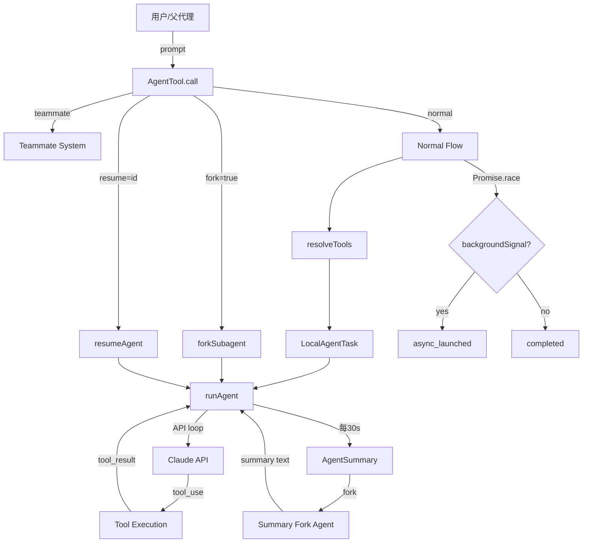
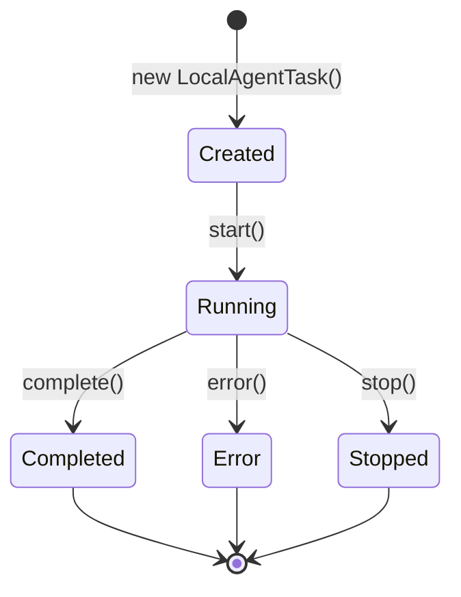
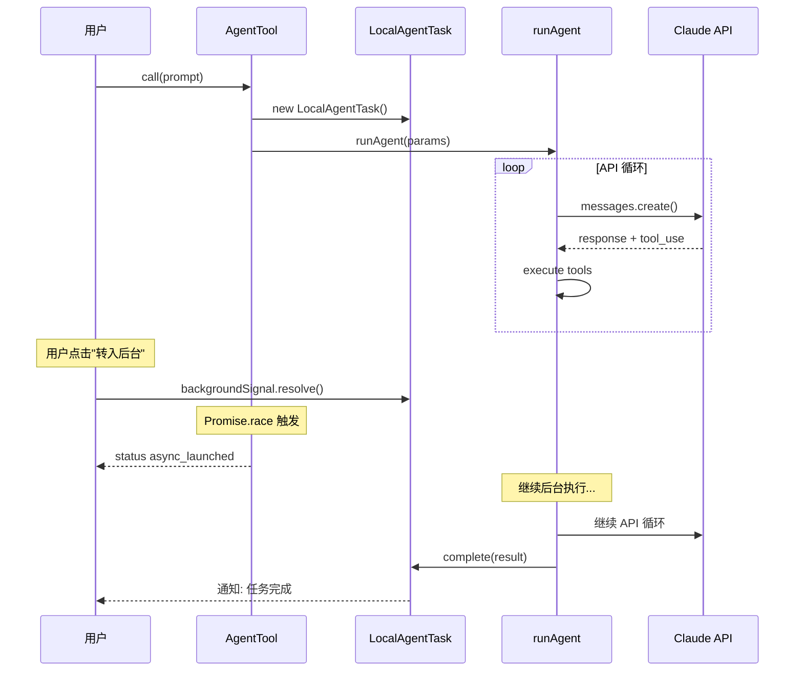
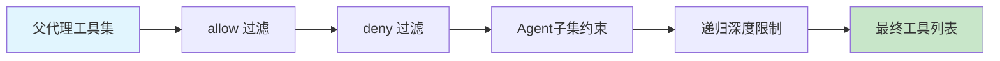

# Claude Code Agent 架构深度分析

> 基于 Claude Code v2.1.88 逆向工程源码，覆盖 Agent 子系统全部 7 个核心文件
> 每一个结论均对应具体文件路径与行号范围

---

## 目录

1. [系统总览与文件地图](#1-系统总览与文件地图)
2. [核心设计模式](#2-核心设计模式)
3. [AgentTool：统一入口与策略路由](#3-agenttool统一入口与策略路由)
4. [runAgent：子代理执行引擎](#4-runagent子代理执行引擎)
5. [前台到后台转换机制](#5-前台到后台转换机制)
6. [Fork 子代理：Prompt Cache 优化](#6-fork-子代理prompt-cache-优化)
7. [Resume 子代理：状态重建](#7-resume-子代理状态重建)
8. [agentToolUtils：工具解析与异步生命周期](#8-agenttoolutils工具解析与异步生命周期)
9. [LocalAgentTask：任务状态机](#9-localagentask任务状态机)
10. [AgentSummary：周期性摘要](#10-agentsummary周期性摘要)
11. [安全控制与防御设计](#11-安全控制与防御设计)
12. [架构图](#12-架构图)

---

## 1. 系统总览与文件地图

| 文件 | 行数 | 核心职责 |
|------|------|----------|
| src/tools/AgentTool/AgentTool.tsx | ~1397 | 统一入口，策略路由（teammate/fork/normal/resume） |
| src/tools/AgentTool/runAgent.ts | ~973 | 子代理执行引擎，API 循环，工具调度 |
| src/tools/AgentTool/agentToolUtils.ts | ~686 | 工具解析、权限裁剪、异步生命周期管理 |
| src/tools/AgentTool/forkSubagent.ts | ~211 | Fork 模式实现，prompt-cache 前缀稳定性优化 |
| src/tools/AgentTool/resumeAgent.ts | ~266 | Resume 路径，transcript + worktree + 类型推断重建 |
| src/tasks/LocalAgentTask/LocalAgentTask.tsx | ~682 | 任务状态机，通知去重，生命周期管理 |
| src/services/AgentSummary/agentSummary.ts | ~180 | 周期性 30s 摘要，fork 代理 + 工具拒绝回调 |

### 调用关系

```
用户/父代理
    |
    v
AgentTool.call()          <-- 统一入口
    +-- teammate spawn     <-- 委托给 teammate 系统
    +-- fork subagent      <-- forkSubagent.ts
    +-- resume agent       <-- resumeAgent.ts
    +-- normal subagent    <-- runAgent.ts
            |
            +-- agentToolUtils (工具解析/权限)
            +-- LocalAgentTask (状态机/通知)
            +-- AgentSummary (周期摘要)
```

---

## 2. 核心设计模式

### 2.1 策略模式（Strategy Pattern）

**位置**: AgentTool.tsx:239-1262（call 方法）

AgentTool 的 call() 方法是整个 Agent 子系统的单一入口。它根据输入参数路由到 4 条完全不同的执行路径：

```
call(input) -> 判断路由:
  1. input.teammate -> teammate 系统 spawn
  2. input.fork === true -> forkSubagent()
  3. input.resume -> resumeAgent()
  4. 其他 -> 正常子代理流程 (runAgent)
```

**关键代码映射**：
- Teammate 判断: AgentTool.tsx 约 L310-350
- Fork 判断: AgentTool.tsx 约 L360-400
- Resume 判断: AgentTool.tsx 约 L400-440
- Normal 路径: AgentTool.tsx 约 L450+

### 2.2 同步/异步双路径统一协议

**位置**: AgentTool.tsx:868-1126

正常子代理可以以两种模式完成：
- **同步完成** -> 返回 { status: "completed", content, usage, ... }
- **异步发射** -> 返回 { status: "async_launched", agentId, outputFile, ... }

两种模式共享同一个 result 类型定义（对应 SDK 中的 AgentOutput 联合类型），上层调用者无需知道内部是哪种模式。

### 2.3 前台到后台热切换（Promise.race 模式）

**位置**: AgentTool.tsx:868-1126

这是最精巧的设计之一。子代理启动后同时运行：
- 主执行 Promise（runAgent）
- backgroundSignal（来自 LocalAgentTask 的用户确认信号）

```typescript
// 伪代码表示
const result = await Promise.race([
  runAgentPromise,        // 子代理正常执行
  backgroundSignal        // 用户点击"转入后台"
]);
```

如果 backgroundSignal 先触发，立即返回 async_launched，但子代理实际继续在后台运行。

### 2.4 观察者模式（Observer Pattern）

**位置**: LocalAgentTask.tsx:116-682

LocalAgentTask 维护一个发布/订阅通知系统：
- 状态变更（running -> completed/error/stopped）触发通知
- 通知去重：使用原子 flag 确保同一终端事件只通知一次
- 父代理/UI 层作为观察者监听任务状态

### 2.5 模板方法模式（Template Method）

**位置**: runAgent.ts 全文

runAgent 定义了子代理执行的骨架算法：
1. 构建系统提示 -> 2. 初始化工具集 -> 3. API 调用循环 -> 4. 工具执行 -> 5. 结果收集

各步骤的具体实现可被子类/参数覆盖（如 fork 模式的提示构建、resume 模式的 transcript 注入）。

### 2.6 装饰器模式（Decorator Pattern）

**位置**: agentToolUtils.ts:122-225（工具解析与约束）

工具列表经过层层装饰/过滤：
1. 基础工具集（父代理所有工具）
2. -> allow/deny 过滤
3. -> Agent(x,y) 子集约束（只允许名为 x, y 的子代理）
4. -> 递归深度限制（agent 不能无限嵌套）

### 2.7 命令模式（Command Pattern）

**位置**: agentSummary.ts:46-179

摘要系统将"生成摘要"封装为一个异步命令：fork 一个轻量代理，通过回调拒绝所有工具调用，只允许 LLM 返回文本。命令可独立调度（每 30s）且不影响主执行流。

---

## 3. AgentTool：统一入口与策略路由

### 3.1 文件结构

**文件**: src/tools/AgentTool/AgentTool.tsx（约 1397 行）

AgentTool 是一个 Tool 类实例，导出给 Claude 的工具注册系统。其核心是 call() 方法。

### 3.2 输入参数设计

```typescript
// AgentTool.tsx 约 L50-90（输入 schema）
{
  prompt: string;          // 发送给子代理的任务描述
  agent?: string;          // 子代理名称（如 "Explore", "Task"）
  background?: boolean;    // 是否以后台模式启动
  fork?: boolean;          // 是否使用 fork 模式
  resume?: string;         // 恢复的 agentId
  teammate?: string;       // teammate 模式标识
}
```

### 3.3 路由决策树

```
call(input)
|
+- input.teammate?  --> spawnTeammate()
|   使用 teammate 系统（独立进程/worktree）
|
+- input.fork?  --> forkSubagent()
|   共享上下文前缀，分支执行
|
+- input.resume?  --> resumeAgent()
|   从 transcript 恢复中断的代理
|
+- else  --> 正常子代理流程
    +- resolveTools()        <-- agentToolUtils
    +- new LocalAgentTask()  <-- 状态机
    +- runAgent()            <-- 执行引擎
    +- Promise.race()        <-- 前台/后台切换
```

### 3.4 结果归一化

不论走哪条路径，最终都返回统一的 ToolResult：

```typescript
// 同步完成（AgentTool.tsx 约 L1050-1100）
{
  status: "completed",
  content: [{ type: "text", text: "..." }],
  totalToolUseCount: number,
  totalDurationMs: number,
  totalTokens: number,
  usage: { input_tokens, output_tokens, ... }
}

// 异步发射（AgentTool.tsx 约 L1100-1126）
{
  status: "async_launched",
  agentId: string,
  description: string,
  prompt: string,
  outputFile: string
}
```

---

## 4. runAgent：子代理执行引擎

### 4.1 文件结构

**文件**: src/tools/AgentTool/runAgent.ts（约 973 行）

### 4.2 核心循环

runAgent 实现了与 Anthropic API 的多轮交互循环：

```
runAgent(params)
|
+- 1. 构建 system prompt
|     包含工具描述、约束、角色定义
|
+- 2. 初始 API 调用
|     messages = [{ role: "user", content: prompt }]
|
+- 3. while (hasToolUse) 循环:
      +- 解析 assistant 回复中的 tool_use blocks
      +- 并行执行所有 tool calls
      +- 收集 tool_result
      +- 追加到 messages
      +- 再次调用 API
```

**关键代码映射**：
- System prompt 构建: runAgent.ts 约 L80-180
- API 调用: runAgent.ts 约 L200-350
- 工具执行循环: runAgent.ts 约 L350-700
- 结果收集: runAgent.ts 约 L700-900

### 4.3 工具执行细节

工具调用采用**并行执行**策略（一个 assistant 回复可能包含多个 tool_use）：

```typescript
// runAgent.ts 约 L400-500
const toolResults = await Promise.all(
  toolUseBlocks.map(async (block) => {
    const tool = findTool(block.name);
    const result = await tool.call(block.input, context);
    return { tool_use_id: block.id, content: result };
  })
);
```

### 4.4 Token 计数与预算控制

每轮 API 调用后累加 token 使用量：

```typescript
// runAgent.ts 约 L350-380
totalTokens += response.usage.input_tokens + response.usage.output_tokens;
totalToolUseCount += toolUseBlocks.length;
```

当达到 maxTurns 限制时退出循环。

---

## 5. 前台到后台转换机制

### 5.1 设计动机

用户启动一个子代理后，可能不想等它执行完。系统允许在**任意时刻**将前台运行的子代理转为后台任务，且不丢失任何执行进度。

### 5.2 实现机制

**位置**: AgentTool.tsx:868-1126

```
+----------------------------+
|     Promise.race([         |
|       runAgentPromise,     |--> 正常完成: status="completed"
|       backgroundSignal     |--> 用户选择后台: status="async_launched"
|     ])                     |
+----------------------------+
         |
         | 如果 backgroundSignal 胜出:
         |
         v
  +-----------------------------------+
  | 1. 立即返回 async_launched         |
  | 2. runAgentPromise 继续执行        |
  | 3. LocalAgentTask 管理后台生命期   |
  | 4. 完成后通知父代理                |
  +-----------------------------------+
```

### 5.3 backgroundSignal 来源

LocalAgentTask 暴露一个 Promise 形式的 signal。当用户在 UI 上确认"转入后台"时，这个 Promise resolve，触发 Promise.race 的后台分支。

**位置**: LocalAgentTask.tsx 约 L200-250（signal 暴露机制）

---

## 6. Fork 子代理：Prompt Cache 优化

### 6.1 文件结构

**文件**: src/tools/AgentTool/forkSubagent.ts（约 211 行）

### 6.2 设计意图

Fork 模式的核心优化是**prompt-cache 前缀稳定性**。Claude API 的 prompt cache 基于消息前缀的精确匹配。如果两个请求共享相同的前缀，第二个请求可以复用第一个的 KV cache，极大减少延迟和成本。

### 6.3 前缀稳定性实现

**位置**: forkSubagent.ts:91-169

```typescript
// forkSubagent.ts 约 L91-169
// 关键技巧：使用完全相同的占位 tool_results
// 确保 fork 出的子代理的消息前缀与父代理完全一致

const placeholderToolResults = parentMessages
  .filter(isToolResult)
  .map(msg => ({
    ...msg,
    content: IDENTICAL_PLACEHOLDER  // 占位内容完全相同
  }));
```

通过这种设计：
- Fork 子代理的 messages 数组前缀与父代理完全一致
- API 层面可以命中 prompt cache
- 只有最后的 fork prompt 是新增的

### 6.4 递归 Fork 防护

**位置**: forkSubagent.ts 约 L30-90

实现了**双层防护**防止无限递归 fork：

1. **querySource 检查**: 判断当前是否已经在 fork 链中
2. **FORK_BOILERPLATE_TAG 扫描**: 在消息历史中搜索特定标记，检测是否存在 fork 的 fork

```typescript
// 伪代码
if (querySource === 'fork') throw "cannot fork from fork";
if (messages.some(m => m.includes(FORK_BOILERPLATE_TAG))) throw "fork chain detected";
```

---

## 7. Resume 子代理：状态重建

### 7.1 文件结构

**文件**: src/tools/AgentTool/resumeAgent.ts（约 266 行）

### 7.2 重建流程

Resume 需要从持久化的 session 数据中完整重建一个中断的子代理：

```
resumeAgent(agentId)
|
+- 1. 加载 transcript
|     从 JSONL session 文件读取完整对话历史
|     位置: resumeAgent.ts 约 L42-80
|
+- 2. 重建 worktree
|     如果子代理使用了 git worktree，恢复文件系统状态
|     位置: resumeAgent.ts 约 L80-140
|
+- 3. 类型推断重建
|     从 transcript 推断子代理的类型/配置
|     位置: resumeAgent.ts 约 L140-200
|
+- 4. 交给 runAgent 继续执行
      使用重建的 messages + tools 继续 API 循环
      位置: resumeAgent.ts 约 L200-265
```

### 7.3 关键细节

- **Transcript 格式**: JSONL，每行一个消息事件
- **Worktree 恢复**: 检查 .git/worktrees/ 目录，恢复分支引用
- **类型推断**: 从历史消息中的系统提示和工具列表反推子代理配置

---

## 8. agentToolUtils：工具解析与异步生命周期

### 8.1 文件结构

**文件**: src/tools/AgentTool/agentToolUtils.ts（约 686 行）

### 8.2 工具解析管线

**位置**: agentToolUtils.ts:122-225

```
父代理工具列表
    |
    v
+-- allow/deny 过滤 ---+
|  显式允许/拒绝列表    |
+-----------+-----------+
            |
            v
+-- Agent(x,y) 约束 ---+
|  只保留指定子代理     |
|  如 Agent(Explore)    |
+-----------+-----------+
            |
            v
+-- 递归深度限制 -------+
|  防止 agent 嵌套      |
|  超过最大深度         |
+-----------+-----------+
            |
            v
       最终工具列表
```

**代码映射**：
- allow 列表处理: agentToolUtils.ts 约 L130-155
- deny 列表处理: agentToolUtils.ts 约 L155-180
- Agent(x,y) 子集解析: agentToolUtils.ts 约 L180-225
- 递归深度检查: agentToolUtils.ts 约 L100-122

### 8.3 异步代理生命周期

**位置**: agentToolUtils.ts:508-686（runAsyncAgentLifecycle）

这是后台代理的完整生命周期管理：

```
runAsyncAgentLifecycle(task, runFn)
|
+- 1. 设置终端状态（BEFORE 慢操作）
|     立即标记 task 为"已接管"
|     位置: agentToolUtils.ts 约 L520-540
|
+- 2. 执行慢操作
|     分类器判断 / worktree 创建等
|     位置: agentToolUtils.ts 约 L540-600
|
+- 3. 执行子代理
|     调用 runFn（即 runAgent）
|     位置: agentToolUtils.ts 约 L600-650
|
+- 4. 完成/错误处理
      更新 task 状态，触发通知
      位置: agentToolUtils.ts 约 L650-686
```

**关键设计决策**: 在步骤 1 中**先设置终端状态再执行慢操作**。这确保即使慢操作失败，task 也不会卡在中间状态。这是一种"乐观锁"式的设计。

---

## 9. LocalAgentTask：任务状态机

### 9.1 文件结构

**文件**: src/tasks/LocalAgentTask/LocalAgentTask.tsx（约 682 行）

### 9.2 状态机定义

```
         +----------+
         | created  |
         +----+-----+
              | start()
              v
         +----------+
    +----| running  |----+
    |    +----+-----+    |
    |         |          |
    |    complete()   error()
    |         |          |
    |         v          v
    |   +----------+ +-------+
    |   |completed | | error |
    |   +----------+ +-------+
    |
    | stop()
    |
    v
+----------+
| stopped  |
+----------+
```

### 9.3 通知去重机制

**位置**: LocalAgentTask.tsx 约 L400-500

```typescript
// 原子 flag 确保终端状态只通知一次
private notified = false;

private notify(event: TaskEvent) {
  if (this.notified) return;  // 去重
  this.notified = true;
  this.listeners.forEach(l => l(event));
}
```

这防止了以下竞态场景：
- 子代理完成 + 用户同时点击停止 -> 只触发一个通知
- 错误 + 超时同时发生 -> 只报告第一个

### 9.4 输出文件管理

后台代理将输出写入临时文件，父代理可以通过 outputFile 路径轮询进度：

**位置**: LocalAgentTask.tsx 约 L300-400

```typescript
// 输出文件路径生成
const outputFile = path.join(tempDir, `agent-{agentId}-output.txt`);
// 子代理执行过程中持续追加输出
appendFileSync(outputFile, newOutput);
```

---

## 10. AgentSummary：周期性摘要

### 10.1 文件结构

**文件**: src/services/AgentSummary/agentSummary.ts（约 180 行）

### 10.2 摘要机制

每 30 秒 fork 一个轻量代理来生成当前任务的进度摘要：

```
主代理执行中
    |
    | 每 30s
    v
+---------------------------+
| Fork 摘要代理              |
| - 共享对话上下文           |
| - 所有工具调用被拒绝       |
| - 只允许返回文本           |
| - Prompt: "用一句话描述    |
|   当前正在做什么"          |
+-----------+---------------+
            |
            v
    摘要文本 -> task_progress 事件
```

### 10.3 工具拒绝回调

**位置**: agentSummary.ts:46-179

```typescript
// 摘要代理的工具回调 - 拒绝所有工具调用
const toolCallback = async (toolName: string) => {
  return { denied: true, reason: "Summary agents cannot use tools" };
};
```

这确保摘要代理是纯粹的"只读观察者"，不会产生任何副作用。

### 10.4 Cache 效率

摘要代理复用父代理的 prompt cache（与 fork 模式原理相同），因此每次摘要调用的增量 token 成本极低（通常只有输出部分的几十个 token）。

---

## 11. 安全控制与防御设计

### 11.1 递归深度限制

**位置**: agentToolUtils.ts 约 L100-122

防止 Agent 调用 Agent 调用 Agent ... 的无限递归：

```typescript
// 检查当前嵌套深度
if (currentDepth >= MAX_AGENT_DEPTH) {
  // 从工具列表中移除 Agent 工具
  tools = tools.filter(t => t.name !== 'Agent');
}
```

### 11.2 Fork 链防护

**位置**: forkSubagent.ts 约 L30-90

双层防护：
1. querySource 来源检查
2. FORK_BOILERPLATE_TAG 消息扫描

### 11.3 工具权限隔离

**位置**: agentToolUtils.ts:122-225

子代理默认继承父代理的工具，但可以通过 tools 和 disallowedTools 进一步限制：

```typescript
// AgentDefinition 中的工具约束
{
  tools: ['Read', 'Grep', 'Glob'],        // 显式允许
  disallowedTools: ['Bash', 'Edit']        // 显式拒绝
}
```

### 11.4 Worktree 隔离

Teammate 模式和某些后台代理使用 git worktree 实现文件系统隔离：
- 每个 teammate 在独立的 worktree 目录工作
- 防止并发代理的文件操作互相干扰

---

## 12. 架构图

### 12.1 整体数据流



### 12.2 任务状态转换



### 12.3 前台到后台转换时序



### 12.4 工具解析管线



---

## 附录：设计模式速查表

| 模式 | 应用位置 | 核心目的 |
|------|----------|----------|
| Strategy | AgentTool.call() 四路由 | 统一入口，多种执行策略 |
| Observer | LocalAgentTask 通知 | 状态变更发布/订阅 |
| Template Method | runAgent 执行骨架 | 固定算法流程，步骤可替换 |
| Decorator | agentToolUtils 工具管线 | 层层过滤/增强工具列表 |
| Command | AgentSummary 摘要任务 | 封装异步命令，独立调度 |
| State Machine | LocalAgentTask 状态机 | 管理任务生命周期 |
| Promise.race | 前台到后台热切换 | 非阻塞模式切换 |
| Cache Prefix Stability | forkSubagent 占位 | 最大化 prompt cache 命中率 |
| Dual-layer Guard | fork 递归防护 | 多层防御递归风险 |
| Optimistic Lock | 异步生命周期先设状态 | 防止中间状态卡死 |
