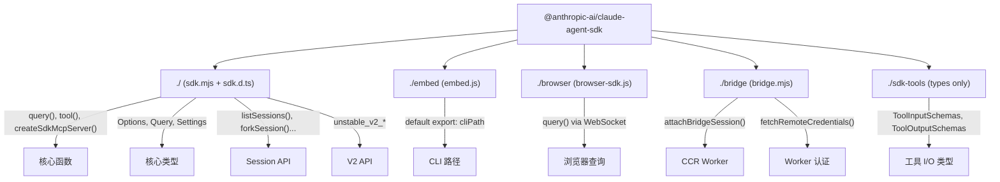
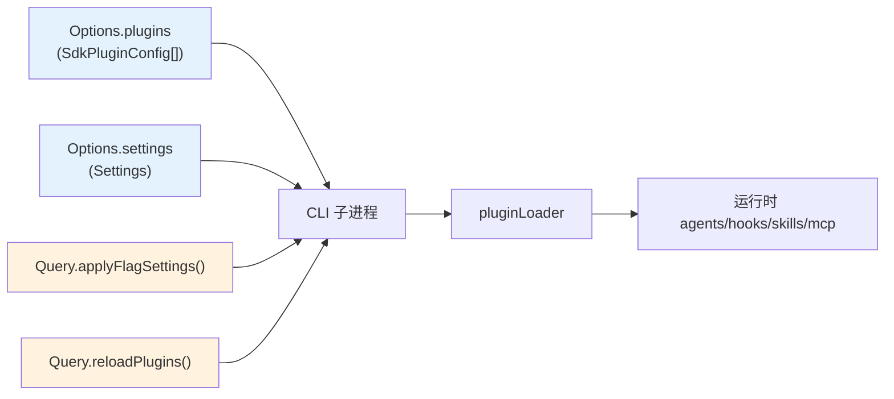
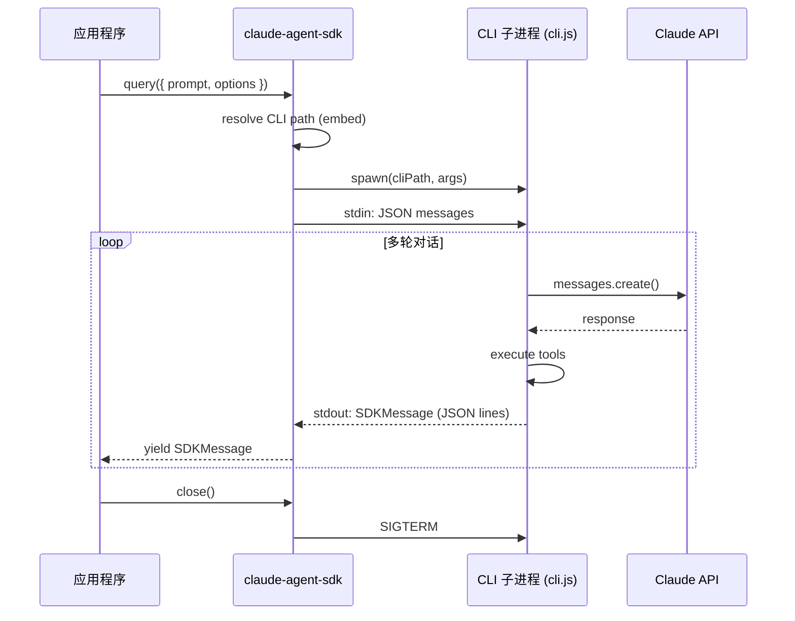
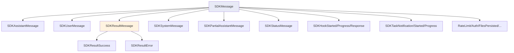

# Claude Agent SDK (TypeScript) 导出架构分析

> 基于 @anthropic-ai/claude-agent-sdk v0.2.92 npm 包的完整分析
> 解析 SDK 如何导出插件相关的类型、函数与运行时接口

---

## 目录

1. [包结构总览](#1-包结构总览)
2. [Export Map 设计](#2-export-map-设计)
3. [主入口 (sdk.mjs / sdk.d.ts)](#3-主入口)
4. [Bridge 入口](#4-bridge-入口)
5. [Browser 入口](#5-browser-入口)
6. [Embed 入口](#6-embed-入口)
7. [sdk-tools 入口](#7-sdk-tools-入口)
8. [Plugin 相关导出详解](#8-plugin-相关导出详解)
9. [Agent 相关导出详解](#9-agent-相关导出详解)
10. [Hook 系统导出](#10-hook-系统导出)
11. [Session 管理 API](#11-session-管理-api)
12. [V2 Unstable API](#12-v2-unstable-api)
13. [类型体系架构图](#13-类型体系架构图)

---

## 1. 包结构总览

### 1.1 文件清单

| 文件 | 大小 | 用途 |
|------|------|------|
| sdk.mjs | 627KB | 主入口运行时（minified） |
| sdk.d.ts | 160KB | 主入口类型定义（4405 行） |
| bridge.mjs | 786KB | Bridge 运行时（CCR 通信） |
| bridge.d.ts | 10KB | Bridge 类型 |
| browser-sdk.js | 591KB | 浏览器版本 |
| browser-sdk.d.ts | 2KB | 浏览器类型 |
| embed.js | 1KB | CLI 可执行路径导出 |
| embed.d.ts | 53B | Embed 类型 |
| sdk-tools.d.ts | 117KB | 工具输入/输出 JSON Schema 类型 |
| cli.js | 13.2MB | 完整 CLI 可执行文件 |
| manifest.json | 1.4KB | 二进制分发清单 |
| agentSdkTypes.d.ts | 25B | 类型重导出桩 |

### 1.2 依赖关系

```json
{
  "dependencies": {
    "@anthropic-ai/sdk": "^0.80.0",
    "@modelcontextprotocol/sdk": "^1.27.1"
  },
  "peerDependencies": {
    "zod": "^4.0.0"
  }
}
```

SDK 构建在 Anthropic 官方 SDK 和 MCP SDK 之上，Zod v4 作为 peer dependency。

---

## 2. Export Map 设计

### 2.1 package.json exports 字段

```json
{
  "exports": {
    ".": {
      "types": "./sdk.d.ts",
      "default": "./sdk.mjs"
    },
    "./embed": {
      "types": "./embed.d.ts",
      "default": "./embed.js"
    },
    "./browser": {
      "types": "./browser-sdk.d.ts",
      "default": "./browser-sdk.js"
    },
    "./bridge": {
      "types": "./bridge.d.ts",
      "default": "./bridge.mjs"
    },
    "./sdk-tools": {
      "types": "./sdk-tools.d.ts"
    },
    "./sdk-tools.js": {
      "types": "./sdk-tools.d.ts"
    }
  }
}
```

### 2.2 五个导出入口的定位

| 入口 | import 路径 | 场景 |
|------|------------|------|
| 主入口 | `@anthropic-ai/claude-agent-sdk` | Node.js 编程使用 SDK |
| embed | `@anthropic-ai/claude-agent-sdk/embed` | 获取 CLI 可执行文件路径 |
| browser | `@anthropic-ai/claude-agent-sdk/browser` | 浏览器端 WebSocket 连接 |
| bridge | `@anthropic-ai/claude-agent-sdk/bridge` | CCR worker 桥接通信 |
| sdk-tools | `@anthropic-ai/claude-agent-sdk/sdk-tools` | 工具 I/O 类型（纯类型） |

### 2.3 类型流转设计

```
agentSdkTypes.d.ts
    |
    +-- re-export --> sdk.d.ts (主入口, 4405 行)
    |
    +-- selective import --> browser-sdk.d.ts
    |
    +-- selective import --> bridge.d.ts
```

`agentSdkTypes.d.ts` 只包含一行 `export * from './sdk.js'`，作为内部类型桥梁。
编译脚本 `build-ant-sdk-typings.sh` 将 `./agentSdkTypes` 重写为 `./sdk`，使最终包结构扁平化。

---

## 3. 主入口

### 3.1 导出的函数

```typescript
// === 核心查询 API ===
export function query(params: {
  prompt: string | AsyncIterable<SDKUserMessage>;
  options?: Options;
}): Query;

// === Session 管理 ===
export function listSessions(options?: ListSessionsOptions): Promise<SDKSessionInfo[]>;
export function getSessionInfo(sessionId: string, options?: GetSessionInfoOptions): Promise<SDKSessionInfo | undefined>;
export function getSessionMessages(sessionId: string, options?: GetSessionMessagesOptions): Promise<SessionMessage[]>;
export function getSubagentMessages(sessionId: string, agentId: string, options?: GetSubagentMessagesOptions): Promise<SessionMessage[]>;
export function listSubagents(sessionId: string, options?: ListSubagentsOptions): Promise<string[]>;
export function renameSession(sessionId: string, title: string, options?: SessionMutationOptions): Promise<void>;
export function tagSession(sessionId: string, tag: string | null, options?: SessionMutationOptions): Promise<void>;
export function forkSession(sessionId: string, options?: ForkSessionOptions): Promise<ForkSessionResult>;

// === MCP 工具 ===
export function createSdkMcpServer(options: CreateSdkMcpServerOptions): McpSdkServerConfigWithInstance;
export function tool<Schema>(name: string, description: string, inputSchema: Schema, handler: Function, extras?: object): SdkMcpToolDefinition<Schema>;

// === V2 Unstable API ===
export function unstable_v2_createSession(options: SDKSessionOptions): SDKSession;
export function unstable_v2_prompt(message: string, options: SDKSessionOptions): Promise<SDKResultMessage>;
export function unstable_v2_resumeSession(sessionId: string, options: SDKSessionOptions): SDKSession;
```

### 3.2 导出的类

```typescript
export class AbortError extends Error {}
```

仅一个错误类，SDK 设计以函数式 + 类型为主。

### 3.3 导出的核心类型（分类）

#### 查询与会话
- `Query` - 查询接口（extends AsyncGenerator）
- `Options` - 查询配置（约 500 行，覆盖所有可能的配置项）
- `SDKSession` - V2 会话接口
- `SDKSessionOptions` - V2 会话配置
- `SDKSessionInfo` - 会话元数据
- `SDKMessage` - 25 种消息类型的联合类型

#### Agent
- `AgentDefinition` - 自定义子代理定义
- `AgentInfo` - 可用代理信息
- `AgentMcpServerSpec` - 代理 MCP 配置

#### Plugin
- `SdkPluginConfig` - SDK 插件配置
- `Settings.enabledPlugins` - 插件启用配置
- `Settings.extraKnownMarketplaces` - Marketplace 配置

#### Hook
- `HookEvent` - 27 种 Hook 事件类型
- `HookCallback` - Hook 回调函数类型
- `HookCallbackMatcher` - Hook 匹配器
- `HookInput` - Hook 输入（27 种变体的联合类型）

#### Permission
- `PermissionMode` - 权限模式
- `CanUseTool` - 工具权限回调
- `PermissionResult` - 权限决策结果
- `PermissionUpdate` - 权限规则更新

#### MCP
- `McpServerConfig` - MCP 服务器配置（4 种变体联合）
- `McpSdkServerConfig` - SDK 内置 MCP 配置
- `SdkMcpToolDefinition` - MCP 工具定义
- `McpServerStatus` - 服务器状态

---

## 4. Bridge 入口

### 4.1 导入路径

```typescript
import { attachBridgeSession } from '@anthropic-ai/claude-agent-sdk/bridge';
```

### 4.2 导出函数

```typescript
// 挂载到 CCR 会话
export function attachBridgeSession(opts: AttachBridgeSessionOptions): Promise<BridgeSessionHandle>;

// 创建新 CCR 会话
export function createCodeSession(baseUrl: string, accessToken: string, title: string, timeoutMs: number, tags?: string[]): Promise<string | null>;

// 获取远程凭证（worker JWT）
export function fetchRemoteCredentials(sessionId: string, baseUrl: string, accessToken: string, timeoutMs: number, trustedDeviceToken?: string): Promise<RemoteCredentials | CredentialsFailure | null>;

// 类型守卫
export function isCredentialsFailure(r: any): r is CredentialsFailure;
```

### 4.3 核心类型

```typescript
// Bridge 会话句柄
type BridgeSessionHandle = {
  readonly sessionId: string;
  getSequenceNum(): number;          // SSE 高水位标记
  isConnected(): boolean;
  write(msg: SDKMessage): void;       // 发送消息
  sendResult(): void;                 // 信号回合边界
  sendControlRequest(req): void;      // 权限请求
  sendControlResponse(res): void;     // 权限回应
  reconnectTransport(opts): Promise<void>;  // JWT 轮换
  reportState(state): void;           // 状态上报
  reportMetadata(metadata): void;     // 元数据上报
  flush(): Promise<void>;
  close(): void;
};

// 远程凭证
type RemoteCredentials = {
  worker_jwt: string;
  api_base_url: string;
  expires_in: number;
  worker_epoch: number;
};
```

Bridge 入口专门用于 CCR（Claude Code Remote）worker 场景 -- 即 claude.ai 网页端的 Code 功能。

---

## 5. Browser 入口

### 5.1 导入路径

```typescript
import { query } from '@anthropic-ai/claude-agent-sdk/browser';
```

### 5.2 导出

```typescript
// 浏览器端查询
export function query(options: BrowserQueryOptions): Query;

// 类型重导出
export type { CanUseTool, Query, SDKMessage, ... } from './agentSdkTypes.js';
export { createSdkMcpServer, tool } from './agentSdkTypes.js';

// 浏览器特有类型
export type BrowserQueryOptions = {
  prompt: AsyncIterable<SDKUserMessage>;
  websocket: WebSocketOptions;             // WebSocket 连接配置
  abortController?: AbortController;
  canUseTool?: CanUseTool;
  hooks?: Partial<Record<HookEvent, HookCallbackMatcher[]>>;
  mcpServers?: Record<string, McpServerConfig>;
  jsonSchema?: Record<string, unknown>;
  onElicitation?: OnElicitation;
};

export type WebSocketOptions = {
  url: string;
  headers?: Record<string, string>;
  authMessage?: AuthMessage;
};

export type AuthMessage = {
  type: 'auth';
  credential: OAuthCredential;
};
```

浏览器入口使用 WebSocket 替代 stdio 与 CLI 子进程通信。

---

## 6. Embed 入口

### 6.1 导入路径

```typescript
import cliPath from '@anthropic-ai/claude-agent-sdk/embed';
```

### 6.2 导出

```typescript
declare const cliPath: string;
export default cliPath;
```

最简单的入口 -- 只导出 CLI 可执行文件的路径字符串。

sdk.mjs 的 `query()` 函数内部使用这个路径来 spawn CLI 子进程。

---

## 7. sdk-tools 入口

### 7.1 导入路径

```typescript
import type { ToolInputSchemas } from '@anthropic-ai/claude-agent-sdk/sdk-tools';
```

### 7.2 说明

这是一个**纯类型入口**（no runtime code）。它包含所有内置工具的输入/输出 JSON Schema 类型定义：

```typescript
export type ToolInputSchemas =
  | AgentInput
  | BashInput
  | FileEditInput
  | FileReadInput
  | FileWriteInput
  | GlobInput
  | GrepInput
  | WebFetchInput
  | WebSearchInput
  | ...;

export type ToolOutputSchemas =
  | AgentOutput
  | BashOutput
  | FileEditOutput
  | FileReadOutput
  | ...;
```

由 `json-schema-to-typescript` 自动生成，共 117KB（约 3000 行）。

---

## 8. Plugin 相关导出详解

### 8.1 SDK 层面的 Plugin 配置

```typescript
// Options.plugins -- SDK 用户可以加载本地插件
export type SdkPluginConfig = {
  type: 'local';
  path: string;   // 本地插件目录路径
};

// 使用示例
const result = query({
  prompt: "Hello",
  options: {
    plugins: [
      { type: 'local', path: './my-plugin' },
      { type: 'local', path: '/absolute/path/to/plugin' }
    ]
  }
});
```

**注意**: SDK 目前只支持 `type: 'local'` 的插件。Marketplace 插件需要通过 Settings 配置。

### 8.2 Settings 中的 Marketplace 配置

```typescript
// Settings.enabledPlugins
enabledPlugins?: {
  [pluginId: string]: boolean | string[] | object;
};

// Settings.extraKnownMarketplaces
extraKnownMarketplaces?: {
  [marketplaceId: string]: {
    source: MarketplaceSource;    // 10+ 种源类型
    installLocation?: string;
    autoUpdate?: boolean;
  };
};
```

这些配置可通过 `Options.settings` 传入 `query()` 或者通过 `Query.applyFlagSettings()` 动态更新。

### 8.3 Marketplace Source 类型联合

SDK 的 Settings 类型中嵌入了完整的 MarketplaceSource 定义：

| Source 类型 | 配置示例 |
|-------------|----------|
| url | `{ source: 'url', url: 'https://...', headers: {} }` |
| github | `{ source: 'github', repo: 'owner/repo', ref: 'main' }` |
| git | `{ source: 'git', url: 'git@host:repo', ref: 'v1.0' }` |
| npm | `{ source: 'npm', package: '@scope/pkg' }` |
| file | `{ source: 'file', path: '/path/to/marketplace.json' }` |
| directory | `{ source: 'directory', path: '/path/to/dir' }` |
| hostPattern | `{ source: 'hostPattern', hostPattern: '^github\\.myco\\.com$' }` |
| pathPattern | `{ source: 'pathPattern', pathPattern: '^/opt/approved/' }` |
| settings | `{ source: 'settings', name: 'inline', plugins: [...] }` |

### 8.4 Query 上的 Plugin 运行时方法

```typescript
interface Query {
  // 重新加载所有插件并返回刷新后的命令/代理/MCP 状态
  reloadPlugins(): Promise<SDKControlReloadPluginsResponse>;

  // 动态设置 MCP 服务器（插件可以注册 MCP 服务器）
  setMcpServers(servers: Record<string, McpServerConfig>): Promise<McpSetServersResult>;

  // 获取可用技能列表（包括插件提供的 skills）
  supportedCommands(): Promise<SlashCommand[]>;

  // 获取可用代理列表（包括插件提供的 agents）
  supportedAgents(): Promise<AgentInfo[]>;
}
```

---

## 9. Agent 相关导出详解

### 9.1 AgentDefinition -- 定义自定义代理

```typescript
export type AgentDefinition = {
  description: string;            // 何时使用此代理
  prompt: string;                 // 系统提示
  tools?: string[];               // 允许的工具（省略则继承全部）
  disallowedTools?: string[];     // 禁止的工具
  model?: string;                 // 模型（如 'sonnet', 'opus'）
  mcpServers?: AgentMcpServerSpec[];
  skills?: string[];              // 预加载的技能
  initialPrompt?: string;         // 自动提交的首条用户消息
  maxTurns?: number;              // 最大轮次
  background?: boolean;           // 后台模式
  memory?: 'user' | 'project' | 'local';  // 记忆文件作用域
  effort?: EffortLevel | number;  // 推理努力级别
  permissionMode?: PermissionMode;
  criticalSystemReminder_EXPERIMENTAL?: string;
};
```

### 9.2 使用示例

```typescript
import { query } from '@anthropic-ai/claude-agent-sdk';

const q = query({
  prompt: "Review this PR",
  options: {
    agent: 'code-reviewer',    // 使用自定义代理
    agents: {
      'code-reviewer': {
        description: 'Reviews code for best practices',
        prompt: 'You are a senior code reviewer...',
        tools: ['Read', 'Grep', 'Glob'],
        model: 'sonnet',
        maxTurns: 10
      },
      'test-runner': {
        description: 'Runs and analyzes test results',
        prompt: 'You run tests and report results...',
        tools: ['Read', 'Bash', 'Glob'],
        background: true
      }
    }
  }
});
```

---

## 10. Hook 系统导出

### 10.1 27 种 Hook 事件

```typescript
export const HOOK_EVENTS = [
  'PreToolUse', 'PostToolUse', 'PostToolUseFailure',
  'Notification', 'UserPromptSubmit',
  'SessionStart', 'SessionEnd',
  'Stop', 'StopFailure',
  'SubagentStart', 'SubagentStop',
  'PreCompact', 'PostCompact',
  'PermissionRequest', 'PermissionDenied',
  'Setup', 'TeammateIdle',
  'TaskCreated', 'TaskCompleted',
  'Elicitation', 'ElicitationResult',
  'ConfigChange',
  'WorktreeCreate', 'WorktreeRemove',
  'InstructionsLoaded', 'CwdChanged', 'FileChanged'
] as const;
```

### 10.2 Hook 回调注册

```typescript
const q = query({
  prompt: "...",
  options: {
    hooks: {
      PreToolUse: [{
        hooks: [async (input, toolUseID, { signal }) => {
          if (input.tool_name === 'Bash') {
            return {
              hookEventName: 'PreToolUse',
              permissionDecision: 'deny',
              permissionDecisionReason: 'Bash disabled'
            };
          }
          return { hookEventName: 'PreToolUse' };
        }]
      }],
      PostToolUse: [{
        hooks: [async (input) => {
          console.log(`Tool ${input.tool_name} completed`);
          return { hookEventName: 'PostToolUse' };
        }]
      }]
    }
  }
});
```

### 10.3 Permission Hook 细节

PreToolUse hook 可以做出权限决策：

```typescript
type HookPermissionDecision = 'allow' | 'deny' | 'ask' | 'defer';
```

---

## 11. Session 管理 API

### 11.1 函数一览

| 函数 | 用途 |
|------|------|
| `listSessions()` | 列出所有会话 |
| `getSessionInfo(id)` | 获取会话元数据 |
| `getSessionMessages(id)` | 获取会话消息历史 |
| `getSubagentMessages(id, agentId)` | 获取子代理消息 |
| `listSubagents(id)` | 列出会话中的子代理 |
| `renameSession(id, title)` | 重命名会话 |
| `tagSession(id, tag)` | 标记会话 |
| `forkSession(id)` | Fork 会话 |

### 11.2 Query 接口上的控制方法

```typescript
interface Query extends AsyncGenerator<SDKMessage, void> {
  interrupt(): Promise<void>;
  setPermissionMode(mode: PermissionMode): Promise<void>;
  setModel(model?: string): Promise<void>;
  setMaxThinkingTokens(tokens: number | null): Promise<void>;
  applyFlagSettings(settings: Settings): Promise<void>;
  initializationResult(): Promise<SDKControlInitializeResponse>;
  supportedCommands(): Promise<SlashCommand[]>;
  supportedModels(): Promise<ModelInfo[]>;
  supportedAgents(): Promise<AgentInfo[]>;
  mcpServerStatus(): Promise<McpServerStatus[]>;
  getContextUsage(): Promise<SDKControlGetContextUsageResponse>;
  reloadPlugins(): Promise<SDKControlReloadPluginsResponse>;
  accountInfo(): Promise<AccountInfo>;
  rewindFiles(userMessageId: string, options?): Promise<RewindFilesResult>;
  seedReadState(path: string, mtime: number): Promise<void>;
  reconnectMcpServer(serverName: string): Promise<void>;
  toggleMcpServer(serverName: string, enabled: boolean): Promise<void>;
  setMcpServers(servers: Record<string, McpServerConfig>): Promise<McpSetServersResult>;
  stopTask(taskId: string): Promise<void>;
  close(): void;
}
```

---

## 12. V2 Unstable API

### 12.1 说明

V2 API 提供持久会话和多轮对话支持，目前标记为 `@alpha`：

```typescript
// 创建持久会话
const session = unstable_v2_createSession({
  model: 'claude-sonnet-4-6'
});

// 发送消息并流式接收
await session.send("What files are here?");
for await (const msg of session.stream()) {
  console.log(msg);
}

// 一次性查询（便利方法）
const result = await unstable_v2_prompt("What files are here?", {
  model: 'claude-sonnet-4-6'
});

// 恢复已有会话
const resumed = unstable_v2_resumeSession(sessionId, {
  model: 'claude-sonnet-4-6'
});
```

### 12.2 SDKSession 接口

```typescript
interface SDKSession {
  readonly sessionId: string;
  send(message: string | SDKUserMessage): Promise<void>;
  stream(): AsyncGenerator<SDKMessage, void>;
  close(): void;
  [Symbol.asyncDispose](): Promise<void>;  // await using 支持
}
```

---

## 13. 类型体系架构图

### 13.1 Export Map 结构



### 13.2 Plugin 配置流转



### 13.3 SDK 与 CLI 交互模型



### 13.4 SDK 消息类型联合



---

## 附录：快速参考

### 导入速查

```typescript
// 主 SDK - Node.js 编程
import { query, tool, createSdkMcpServer } from '@anthropic-ai/claude-agent-sdk';

// 获取 CLI 路径
import cliPath from '@anthropic-ai/claude-agent-sdk/embed';

// 浏览器端
import { query } from '@anthropic-ai/claude-agent-sdk/browser';

// CCR Worker 桥接
import { attachBridgeSession, fetchRemoteCredentials } from '@anthropic-ai/claude-agent-sdk/bridge';

// 工具类型（纯类型）
import type { AgentInput, BashOutput } from '@anthropic-ai/claude-agent-sdk/sdk-tools';
```

### Plugin 开发者关键类型

```typescript
import type {
  AgentDefinition,     // 定义自定义代理
  HookEvent,           // Hook 事件名
  HookCallbackMatcher, // Hook 注册
  SlashCommand,        // 技能/命令
  SdkPluginConfig,     // 插件配置
  McpServerConfig,     // MCP 服务器配置
  SdkMcpToolDefinition // MCP 工具定义
} from '@anthropic-ai/claude-agent-sdk';
```
