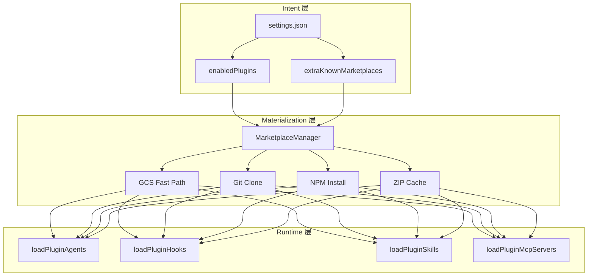
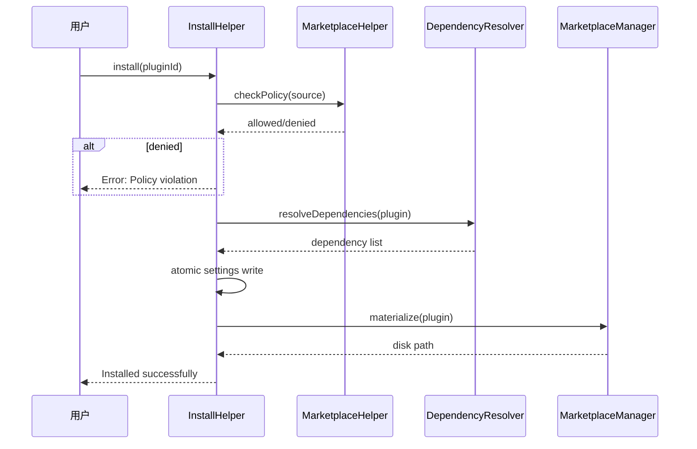
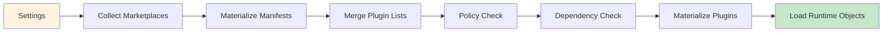
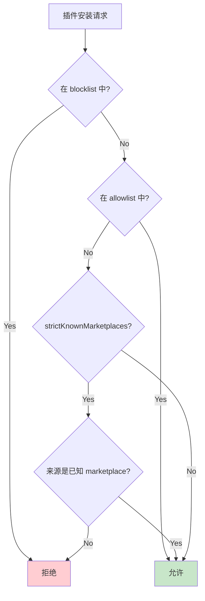

# Claude Code Plugin 与 Marketplace 架构深度分析

> 基于 Claude Code v2.1.88 逆向工程源码，覆盖 Plugin 子系统全部 20+ 核心文件
> 每一个结论均对应具体文件路径与行号范围

---

## 目录

1. [系统总览与文件地图](#1-系统总览与文件地图)
2. [三层架构模型](#2-三层架构模型)
3. [核心设计模式](#3-核心设计模式)
4. [pluginLoader：加载管线详解](#4-pluginloader加载管线详解)
5. [marketplaceManager：Marketplace 生命周期](#5-marketplacemanager-marketplace-生命周期)
6. [schemas：数据模型与校验](#6-schemas数据模型与校验)
7. [安装流程与策略控制](#7-安装流程与策略控制)
8. [依赖解析器](#8-依赖解析器)
9. [GCS 快速路径与 ZIP 缓存](#9-gcs-快速路径与-zip-缓存)
10. [Reconciler：增量同步](#10-reconciler增量同步)
11. [插件运行时加载](#11-插件运行时加载)
12. [安全与策略模型](#12-安全与策略模型)
13. [架构图](#13-架构图)

---

## 1. 系统总览与文件地图

### 1.1 核心文件

| 文件 | 行数 | 核心职责 |
|------|------|----------|
| src/utils/plugins/pluginLoader.ts | ~3302 | 插件加载管线主入口，两种模式（full/cacheOnly） |
| src/utils/plugins/marketplaceManager.ts | ~2643 | Marketplace 全生命周期管理 |
| src/utils/plugins/schemas.ts | ~1681 | Zod schema 定义，13+ 数据模型 |
| src/utils/plugins/pluginInstallationHelpers.ts | ~481 | 安装流程 chokepoint |
| src/utils/plugins/marketplaceHelpers.ts | ~505 | 策略评估（blocklist/allowlist） |
| src/utils/plugins/dependencyResolver.ts | ~132 | 依赖解析器（"存在性保证"模型） |
| src/utils/plugins/officialMarketplaceGcs.ts | ~170 | GCS 快速路径（.gcs-sha sentinel） |
| src/utils/plugins/reconciler.ts | ~234 | 增量同步（只增不删） |
| src/utils/plugins/zipCache.ts | ~150 | ZIP 缓存（exec 权限保留） |
| src/utils/plugins/pluginOptionsStorage.ts | ~399 | 敏感选项安全存储 |

### 1.2 运行时加载文件

| 文件 | 行数 | 核心职责 |
|------|------|----------|
| src/utils/plugins/loadPluginAgents.ts | ~168 | 插件自定义代理加载 |
| src/utils/plugins/loadPluginHooks.ts | ~167 | 插件钩子注册（原子 clear-then-register） |
| src/utils/plugins/loadPluginSkills.ts | ~200 | 技能加载 |
| src/utils/plugins/loadPluginMcpServers.ts | ~180 | MCP 服务器加载 |

---

## 2. 三层架构模型

Claude Code 的插件系统采用清晰的三层分离架构：

```
+=============================================+
|  Intent 层 (意图层)                          |
|  settings.json 中的 enabledPlugins           |
|  用户声明"我想要哪些插件"                     |
+=============================================+
              |
              | materialize (物化)
              v
+=============================================+
|  Materialization 层 (物化层)                  |
|  磁盘缓存：~/.claude/plugins/                |
|  插件的实际文件（git clone / npm install）     |
+=============================================+
              |
              | load (加载)
              v
+=============================================+
|  Runtime 层 (运行时层)                        |
|  AppState 中的活跃插件对象                    |
|  agents / hooks / skills / mcpServers        |
+=============================================+
```

### 2.1 Intent 层

**位置**: Settings 中的 enabledPlugins 字段

```typescript
// settings.json
{
  "enabledPlugins": {
    "formatter@anthropic-tools": true,
    "linter@my-company": { "version": "^2.0" }
  }
}
```

### 2.2 Materialization 层

**位置**: pluginLoader.ts 中的 materialize 逻辑

插件源被下载/克隆到本地磁盘缓存。支持多种源类型：
- git clone（github / git URL）
- npm install
- file/directory（本地路径）
- ZIP 下载

### 2.3 Runtime 层

**位置**: pluginLoader.ts 最终输出 + loadPlugin*.ts 文件

物化后的插件目录被解析为运行时对象，注入到 AppState。

---

## 3. 核心设计模式

### 3.1 源合并与优先级（Source Merging）

**位置**: pluginLoader.ts 约 L200-400

插件来源有明确的优先级：

```
session (--plugin-dir CLI) > marketplace > builtin
```

但存在一个重要例外：**managed policy 可以覆盖 session 来源**。

```typescript
// pluginLoader.ts 约 L300-350
// 如果 managed settings 启用了 strictPluginOnlyCustomization
// 则 session 来源的自定义会被阻断
if (managedPolicy.strictPluginOnlyCustomization) {
  // 只允许通过 managed marketplace 安装的插件
}
```

### 3.2 双加载模式

**位置**: pluginLoader.ts 入口函数

```typescript
// 完整加载（包含网络请求）
export async function loadAllPlugins(...) { ... }

// 缓存优先加载（启动时使用，无网络）
export async function loadAllPluginsCacheOnly(...) { ... }
```

两个函数均使用 memoization 避免重复加载。cacheOnly 模式在 CLI 启动时使用以减少启动延迟。

### 3.3 Fail-Closed 安全模型

**位置**: pluginLoader.ts:1922-2000

```
if (marketplace source 不可验证 AND 策略已激活) {
  -> 阻断加载（fail-closed）
  -> 而非允许加载（fail-open）
}
```

这是一个关键的安全设计决策：宁可功能不可用，也不加载未经验证的插件。

### 3.4 原子写入模式

多处使用 staging + atomic swap：
- GCS 下载: officialMarketplaceGcs.ts:47-170
- Settings 更新: pluginInstallationHelpers.ts
- Hook 注册: loadPluginHooks.ts:138-167

---

## 4. pluginLoader：加载管线详解

### 4.1 文件结构

**文件**: src/utils/plugins/pluginLoader.ts（约 3302 行）

这是 Plugin 子系统中最大的文件，包含整个加载管线。

### 4.2 加载管线流程

```
loadAllPlugins()
|
+- 1. 收集所有 marketplace 配置
|     从 settings 中读取 extraKnownMarketplaces
|     位置: pluginLoader.ts 约 L100-200
|
+- 2. 对每个 marketplace 执行 materialize
|     下载/更新 marketplace manifest
|     位置: pluginLoader.ts 约 L200-500
|
+- 3. 合并所有可用插件列表
|     session + marketplace + builtin
|     位置: pluginLoader.ts 约 L500-800
|
+- 4. 对每个 enabled plugin:
|     a. 策略检查（blocklist/allowlist）
|     b. 依赖解析
|     c. 物化到磁盘
|     d. 加载 frontmatter
|     位置: pluginLoader.ts 约 L800-2000
|
+- 5. 构建运行时对象
|     agents, hooks, skills, mcpServers
|     位置: pluginLoader.ts 约 L2000-3000
|
+- 6. 返回合并结果
      位置: pluginLoader.ts 约 L3000-3302
```

### 4.3 Memoization 机制

```typescript
// pluginLoader.ts 约 L50-80
let cachedResult: PluginLoadResult | null = null;

export async function loadAllPlugins(...) {
  if (cachedResult) return cachedResult;
  // ... 完整加载逻辑
  cachedResult = result;
  return result;
}
```

---

## 5. marketplaceManager：Marketplace 生命周期

### 5.1 文件结构

**文件**: src/utils/plugins/marketplaceManager.ts（约 2643 行）

### 5.2 Marketplace 源类型

支持 10+ 种 MarketplaceSource 类型：

| Source 类型 | 说明 | 代码位置 |
|-------------|------|----------|
| url | 直接 URL 指向 marketplace.json | marketplaceManager.ts ~L100 |
| github | GitHub owner/repo 格式 | marketplaceManager.ts ~L150 |
| git | 任意 git URL | marketplaceManager.ts ~L200 |
| npm | NPM 包 | marketplaceManager.ts ~L250 |
| file | 本地文件路径 | marketplaceManager.ts ~L300 |
| directory | 本地目录 | marketplaceManager.ts ~L320 |
| settings | settings.json 内联定义 | marketplaceManager.ts ~L350 |
| hostPattern | 正则匹配主机名 | marketplaceManager.ts ~L400 |
| pathPattern | 正则匹配文件路径 | marketplaceManager.ts ~L420 |

### 5.3 Seed 目录机制

**位置**: marketplaceManager.ts:380-434

```typescript
// Seed directories: first-seed-wins
// 第一个 seed 的 marketplace 目录会被使用
// 后续相同 marketplace 的 seed 被忽略
// 且 autoUpdate 被强制设为 false
```

这个设计防止了多个 settings 源对同一 marketplace 的缓存目录产生冲突。

### 5.4 Marketplace Manifest 结构

```json
{
  "name": "my-marketplace",
  "version": "1.0.0",
  "plugins": [
    {
      "name": "formatter",
      "source": "github:user/repo",
      "description": "Code formatter plugin",
      "version": "1.2.0"
    }
  ],
  "owner": {
    "name": "My Company",
    "email": "support@example.com"
  }
}
```

---

## 6. schemas：数据模型与校验

### 6.1 文件结构

**文件**: src/utils/plugins/schemas.ts（约 1681 行）

### 6.2 核心 Schema

| Schema | 说明 | 代码位置 |
|--------|------|----------|
| PluginMarketplaceSchema | Marketplace manifest 校验 | schemas.ts ~L50-150 |
| PluginSourceSchema | 插件源定义（10+ 变体） | schemas.ts ~L150-400 |
| PluginManifestSchema | 单个插件的 manifest | schemas.ts ~L400-600 |
| PluginFrontmatterSchema | 插件 YAML frontmatter | schemas.ts ~L600-900 |
| PluginSettingsSchema | Settings 中的插件配置 | schemas.ts ~L900-1100 |
| MarketplaceSourceSchema | Marketplace 源类型联合 | schemas.ts ~L1100-1400 |
| PluginDependencySchema | 依赖声明 | schemas.ts ~L1400-1500 |

### 6.3 Zod 校验设计

所有 schema 使用 Zod 定义，支持：
- 运行时类型校验
- TypeScript 类型推导
- 详细错误消息
- 自定义 refinement（如版本号格式检查）

```typescript
// schemas.ts 示例
const PluginSourceSchema = z.discriminatedUnion("source", [
  z.object({ source: z.literal("github"), repo: z.string(), ... }),
  z.object({ source: z.literal("npm"), package: z.string(), ... }),
  z.object({ source: z.literal("url"), url: z.string().url(), ... }),
  // ... 更多变体
]);
```

---

## 7. 安装流程与策略控制

### 7.1 安装 Chokepoint

**文件**: src/utils/plugins/pluginInstallationHelpers.ts（约 481 行）

所有插件安装都经过一个统一的 chokepoint（瓶颈点）：

```
安装请求
|
+- 1. 策略检查
|     blocklist/allowlist 评估
|     位置: pluginInstallationHelpers.ts 约 L348-380
|
+- 2. 依赖解析
|     检查所有依赖是否满足
|     位置: pluginInstallationHelpers.ts 约 L380-420
|
+- 3. 原子 settings 写入
|     更新 enabledPlugins
|     位置: pluginInstallationHelpers.ts 约 L420-460
|
+- 4. 物化
      下载/克隆插件到磁盘
      位置: pluginInstallationHelpers.ts 约 L460-481
```

### 7.2 策略评估

**文件**: src/utils/plugins/marketplaceHelpers.ts（约 505 行）

**位置**: marketplaceHelpers.ts:461-505

策略评估顺序：**blocklist 优先于 allowlist**

```
评估流程:
1. 检查 blocklist -> 如果匹配 -> 拒绝
2. 检查 allowlist -> 如果匹配 -> 允许
3. 默认 -> 根据 strictKnownMarketplaces 决定
```

策略支持 hostPattern 和 pathPattern 模式匹配：

```typescript
// marketplaceHelpers.ts 约 L470-505
// hostPattern: 正则匹配域名
// pathPattern: 正则匹配文件路径
const isAllowed = allowlist.some(entry => {
  if (entry.source === 'hostPattern') {
    return new RegExp(entry.hostPattern).test(host);
  }
  if (entry.source === 'pathPattern') {
    return new RegExp(entry.pathPattern).test(path);
  }
  return exactMatch(entry, source);
});
```

---

## 8. 依赖解析器

### 8.1 文件结构

**文件**: src/utils/plugins/dependencyResolver.ts（约 132 行）

### 8.2 "存在性保证"模型

**位置**: dependencyResolver.ts:95-132

Claude Code 的插件依赖模型与 npm 等包管理器不同。它采用**存在性保证**（presence guarantee）而非模块链接：

```
依赖声明: plugin-a depends on plugin-b

含义: "plugin-b 必须已安装且可用"
不含义: "plugin-a 可以 import plugin-b 的代码"
```

### 8.3 跨 Marketplace 限制

**位置**: dependencyResolver.ts:95-132

```typescript
// 跨 marketplace 的自动安装被阻止
// plugin-a (来自 marketplace-X) 声明依赖 plugin-b (来自 marketplace-Y)
// -> 不会自动安装 plugin-b
// -> 需要用户手动安装 plugin-b
```

这个限制防止了供应链攻击：一个 marketplace 的插件不能自动拉取另一个 marketplace 的依赖。

---

## 9. GCS 快速路径与 ZIP 缓存

### 9.1 GCS 快速路径

**文件**: src/utils/plugins/officialMarketplaceGcs.ts（约 170 行）

**位置**: officialMarketplaceGcs.ts:47-170

官方 marketplace 使用 Google Cloud Storage 快速路径：

```
GCS 快速路径流程:
|
+- 1. 检查 .gcs-sha sentinel 文件
|     如果本地 SHA 与远程相同 -> 跳过下载
|     位置: officialMarketplaceGcs.ts 约 L47-80
|
+- 2. 下载到 staging 目录
|     位置: officialMarketplaceGcs.ts 约 L80-130
|
+- 3. Atomic swap（原子替换）
|     staging -> final 目录
|     位置: officialMarketplaceGcs.ts 约 L130-160
|
+- 4. 更新 .gcs-sha sentinel
      位置: officialMarketplaceGcs.ts 约 L160-170
```

### 9.2 ZIP 缓存

**文件**: src/utils/plugins/zipCache.ts（约 150 行）

**环境变量**: CLAUDE_CODE_PLUGIN_USE_ZIP_CACHE

```
ZIP 缓存特性:
- 下载的 ZIP 插件包缓存在 session temp 目录
- 解压时保留文件的 exec 权限位
- 通过内容 hash 判断是否需要重新解压
```

这对需要可执行脚本的插件（如 hooks）特别重要。

---

## 10. Reconciler：增量同步

### 10.1 文件结构

**文件**: src/utils/plugins/reconciler.ts（约 234 行）

### 10.2 只增不删策略

**位置**: reconciler.ts:50-83, 114-234

Reconciler 的核心设计原则是**只增不删（additive only）**：

```
Reconcile(remote, local):
|
+- 对于 remote 中有但 local 中没有的 -> 添加到 local
|
+- 对于 remote 中有且 local 中也有的 -> 更新 local（如果版本更新）
|
+- 对于 remote 中没有但 local 中有的 -> 保留 local（不删除！）
```

这意味着：
- 一旦安装的插件永远不会被 reconciler 自动删除
- 用户必须手动卸载不需要的插件
- 即使 marketplace 移除了某个插件，已安装的本地副本仍然保留

---

## 11. 插件运行时加载

### 11.1 Agent 加载

**文件**: src/utils/plugins/loadPluginAgents.ts（约 168 行）

**关键行为**: loadPluginAgents.ts:153-168

```typescript
// 插件代理会忽略以下 frontmatter 字段:
// - permissionMode
// - hooks
// - mcpServers
// 这些字段只对独立代理有效，插件代理不继承
```

### 11.2 Hook 注册

**文件**: src/utils/plugins/loadPluginHooks.ts（约 167 行）

**位置**: loadPluginHooks.ts:138-167

Hook 注册采用**原子 clear-then-register** 策略：

```
注册流程:
1. 清除所有当前插件 hooks
2. 重新注册所有活跃插件的 hooks
3. 这是一个原子操作（无中间状态可见）
```

### 11.3 敏感选项存储

**文件**: src/utils/plugins/pluginOptionsStorage.ts（约 399 行）

**位置**: pluginOptionsStorage.ts:56-77, 385-399

```typescript
// 敏感选项（如 API key）使用安全存储
// 非敏感选项存储在 settings.json
// 内容替换（content substitution）保护敏感值不出现在日志中
```

---

## 12. 安全与策略模型

### 12.1 Fail-Closed 原则

**位置**: pluginLoader.ts:1922-2000

```
不可验证的 marketplace + 激活的策略 = 阻断
```

### 12.2 strictKnownMarketplaces

设置 strictKnownMarketplaces 后，只有在已知 marketplace 列表中的源才被允许。未知来源被拒绝。

### 12.3 Plugin 来源策略层次

```
managed settings (最高优先级)
    |
    v
strictKnownMarketplaces (已知来源限制)
    |
    v
blocklist (显式拒绝)
    |
    v
allowlist (显式允许)
    |
    v
default behavior (默认行为)
```

### 12.4 供应链安全

- 跨 marketplace 依赖不自动安装
- GCS 快速路径使用 SHA 校验
- Atomic swap 防止部分下载被使用
- Reconciler 只增不删，防止远程删除本地插件

---

## 13. 架构图

### 13.1 三层架构总览



### 13.2 安装流程



### 13.3 加载管线



### 13.4 策略评估流程



---

## 附录：设计模式速查表

| 模式 | 应用位置 | 核心目的 |
|------|----------|----------|
| Three-Layer | Intent/Material/Runtime | 关注点分离，支持离线启动 |
| Source Merging | pluginLoader 优先级合并 | 多来源插件有序合并 |
| Fail-Closed | pluginLoader 策略门 | 不可验证时安全阻断 |
| Memoization | loadAllPlugins 缓存 | 避免重复加载 |
| Atomic Write | GCS / Settings / Hooks | 防止部分状态可见 |
| Additive Only | Reconciler 只增不删 | 防止远程意外删除 |
| Presence Guarantee | 依赖解析器 | 只保证存在不建立链接 |
| Chokepoint | 安装统一入口 | 所有安装走同一路径 |
| SHA Sentinel | GCS .gcs-sha 文件 | 增量更新判断 |
| Staging + Swap | GCS 下载流程 | 原子替换防止中间状态 |
| Clear-then-Register | Hook 注册 | 原子重置避免残留 |
| Content Substitution | 敏感选项保护 | 防止密钥泄露到日志 |
| Discriminated Union | Zod schema | 类型安全的多变体校验 |
